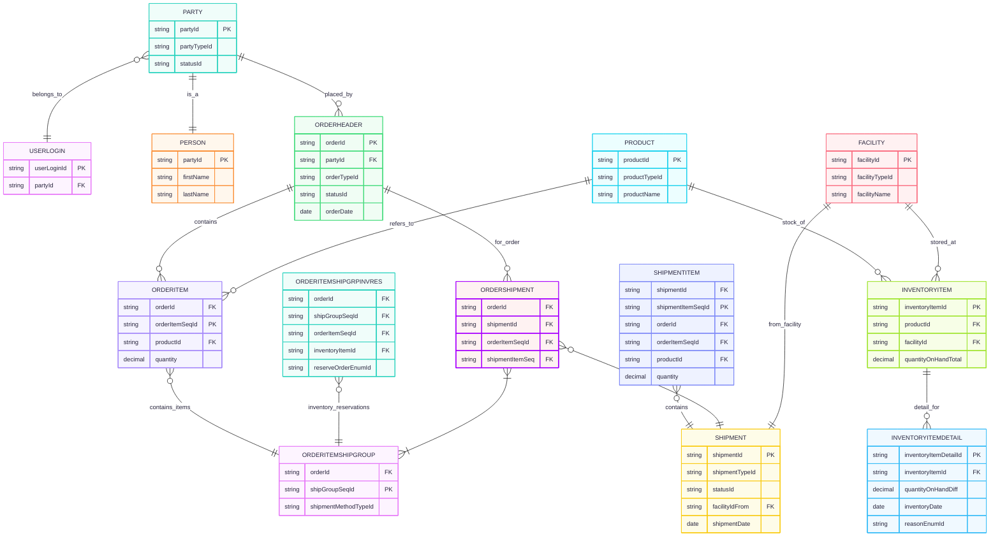

# Data-modelling

<!-- 
    Steps for Cash-to-Process (Sales Order) Flow:

    Step 1: User and Party Creation
    Step 2: Contact Mechanism Setup
    Step 3: Product and Pricing
    Step 4: Order Creation (Sales Order)
    Step 5: Order Ship Group
    Step 6: Inventory Check
    Step 7: Shipment Creation
    Step 8: Inventory Update
    Step 9: Order Completion 
-->

